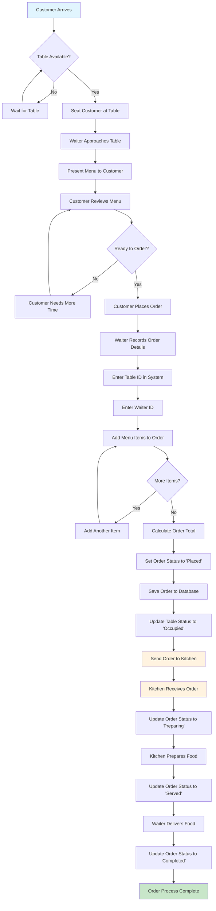
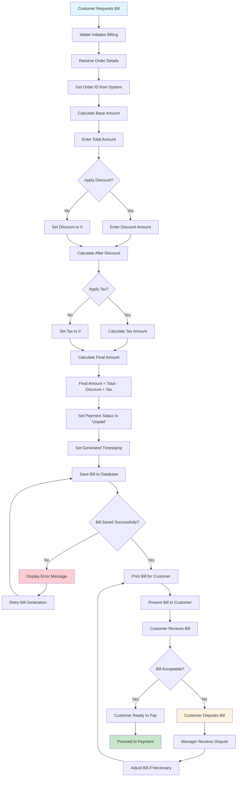
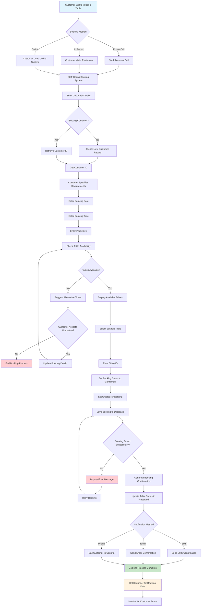
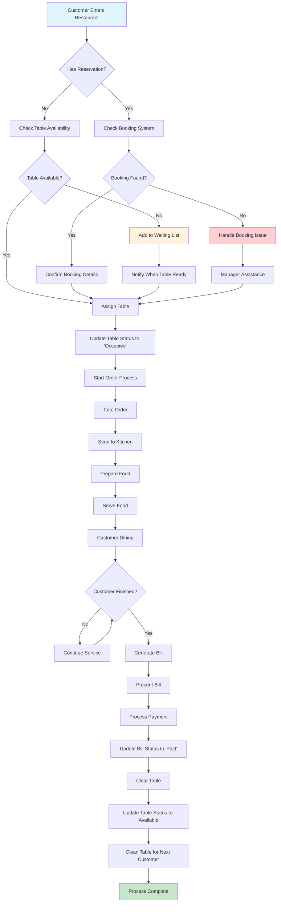

```mermaid
classDiagram
    %% Model Classes
    class User {
        -int userId
        -String username
        -String password
        -String email
        -String phone
        -Role role
        -boolean active
        -Timestamp createdAt
        +getUserId() int
        +setUserId(int)
        +getUsername() String
        +setUsername(String)
        +getRole() Role
        +setRole(Role)
    }

    class Customer {
        -int customerId
        -String name
        -String phone
        -String email
        -boolean active
        -Timestamp createdAt
        +getCustomerId() int
        +setCustomerId(int)
        +getName() String
        +setName(String)
    }

    class Table {
        -int tableId
        -int tableNumber
        -int capacity
        -Status status
        +getTableId() int
        +setTableId(int)
        +getTableNumber() int
        +setTableNumber(int)
        +getStatus() Status
        +setStatus(Status)
    }

    class Order {
        -int orderId
        -int tableId
        -int waiterId
        -Timestamp orderTime
        -Status status
        +getOrderId() int
        +setOrderId(int)
        +getTableId() int
        +setTableId(int)
        +getStatus() Status
        +setStatus(Status)
    }

    class Bill {
        -int billId
        -int orderId
        -double totalAmount
        -double discount
        -double tax
        -double finalAmount
        -PaymentStatus paymentStatus
        -Timestamp generatedAt
        +getBillId() int
        +setBillId(int)
        +getOrderId() int
        +setOrderId(int)
        +getFinalAmount() double
        +setFinalAmount(double)
    }

    class Payment {
        -int paymentId
        -int billId
        -double amountPaid
        -String paymentMethod
        -Timestamp paymentTime
        +getPaymentId() int
        +setPaymentId(int)
        +getBillId() int
        +setBillId(int)
        +getAmountPaid() double
        +setAmountPaid(double)
    }

    class MenuItem {
        -int itemId
        -String name
        -String description
        -double price
        -String category
        -boolean available
        +getItemId() int
        +setItemId(int)
        +getName() String
        +setName(String)
        +getPrice() double
        +setPrice(double)
    }

    class TableBooking {
        -int bookingId
        -int customerId
        -int tableId
        -Date bookingDate
        -Time bookingTime
        -Status status
        +getBookingId() int
        +setBookingId(int)
        +getCustomerId() int
        +setCustomerId(int)
        +getTableId() int
        +setTableId(int)
    }

    class SalesReport {
        -int reportId
        -Date reportDate
        -double totalSales
        -int totalOrders
        -String topItems
        -int generatedBy
        +getReportId() int
        +setReportId(int)
        +getTotalSales() double
        +setTotalSales(double)
    }

    %% DAO Interfaces
    class UserDAO {
        <<interface>>
        +addUser(User)
        +getUserById(int) User
        +getAllUsers() List~User~
        +updateUser(User)
        +deleteUser(int)
    }

    class CustomerDAO {
        <<interface>>
        +addCustomer(Customer)
        +getCustomerById(int) Customer
        +getAllCustomers() List~Customer~
        +updateCustomer(Customer)
        +deleteCustomer(int)
    }

    class TableDAO {
        <<interface>>
        +addTable(Table)
        +getTableById(int) Table
        +getAllTables() List~Table~
        +updateTable(Table)
        +deleteTable(int)
    }

    class OrderDAO {
        <<interface>>
        +addOrder(Order)
        +getOrderById(int) Order
        +getAllOrders() List~Order~
        +updateOrder(Order)
        +deleteOrder(int)
    }

    class BillDAO {
        <<interface>>
        +generateBill(Bill)
        +getBillByOrderId(int) Bill
        +getBillById(int) Bill
        +getUnpaidBills() List~Bill~
        +updateBill(Bill)
        +deleteBill(int)
    }

    class PaymentDAO {
        <<interface>>
        +recordPayment(Payment)
        +getPaymentByBillId(int) Payment
        +getAllPayments() List~Payment~
    }

    class MenuItemDAO {
        <<interface>>
        +addMenuItem(MenuItem)
        +getMenuItemById(int) MenuItem
        +getAllMenuItems() List~MenuItem~
        +updateMenuItem(MenuItem)
        +deleteMenuItem(int)
    }

    class SalesReportDAO {
        <<interface>>
        +generateReport(SalesReport)
        +getAllReports() List~SalesReport~
    }

    %% DAO Implementations
    class UserDAOImpl {
        -Connection connection
        +addUser(User)
        +getUserById(int) User
        +getAllUsers() List~User~
        +updateUser(User)
        +deleteUser(int)
    }

    class CustomerDAOImpl {
        -Connection connection
        +addCustomer(Customer)
        +getCustomerById(int) Customer
        +getAllCustomers() List~Customer~
        +updateCustomer(Customer)
        +deleteCustomer(int)
    }

    class BillDAOImpl {
        -Connection connection
        +generateBill(Bill)
        +getBillByOrderId(int) Bill
        +getBillById(int) Bill
        +getUnpaidBills() List~Bill~
        +updateBill(Bill)
        +deleteBill(int)
    }

    class SalesReportDAOImpl {
        -Connection connection
        +generateReport(SalesReport)
        +getAllReports() List~SalesReport~
    }

    %% Factory
    class RestaurantDAOFactory {
        -Connection connection
        +getUserDAO() UserDAO
        +getCustomerDAO() CustomerDAO
        +getTableDAO() TableDAO
        +getOrderDAO() OrderDAO
        +getBillDAO() BillDAO
        +getPaymentDAO() PaymentDAO
        +getMenuItemDAO() MenuItemDAO
        +getSalesReportDAO() SalesReportDAO
    }

    %% Services
    class CustomerService {
        <<interface>>
        +addCustomer(Customer)
        +getCustomerById(int) Customer
        +getAllCustomers() List~Customer~
        +updateCustomer(Customer)
    }

    class CustomerServiceImpl {
        +addCustomer(Customer)
        +getCustomerById(int) Customer
        +getAllCustomers() List~Customer~
        +updateCustomer(Customer)
    }

    class BillService {
        <<interface>>
        +generateBill(Bill)
        +getBillByOrderId(int) Bill
        +updatePaymentStatus(int, String)
    }

    class BillServiceImpl {
        +generateBill(Bill)
        +getBillByOrderId(int) Bill
        +updatePaymentStatus(int, String)
    }

    %% Controllers
    class CustomerController {
        -CustomerService customerService
        -Scanner scanner
        +addCustomer()
        +getCustomerById()
        +listAllCustomers()
    }

    class SalesReportController {
        -Scanner scanner
        +generateReport()
    }

    %% Utility
    class DatabaseUtil {
        -String URL
        -String USER
        -String PASSWORD
        +getConnection() Connection
    }

    class Main {
        +main(String[])
        +handleUserManagement()
        +handleCustomerManagement()
        +handleTableManagement()
        +handleOrderManagement()
        +handleBillManagement()
        +handlePaymentManagement()
    }

    %% Relationships
    Order --> Table : "placed at"
    Order --> User : "served by"
    Bill --> Order : "generated for"
    Payment --> Bill : "pays"
    TableBooking --> Customer : "made by"
    TableBooking --> Table : "reserves"

    
    %% DAO Implementation relationships
    UserDAOImpl ..|> UserDAO
    CustomerDAOImpl ..|> CustomerDAO
    BillDAOImpl ..|> BillDAO
    SalesReportDAOImpl ..|> SalesReportDAO
    
    %% Service Implementation relationships
    CustomerServiceImpl ..|> CustomerService
    BillServiceImpl ..|> BillService
    
    %% Factory relationships
    RestaurantDAOFactory --> UserDAO
    RestaurantDAOFactory --> CustomerDAO
    RestaurantDAOFactory --> TableDAO
    RestaurantDAOFactory --> OrderDAO
    RestaurantDAOFactory --> BillDAO
    RestaurantDAOFactory --> PaymentDAO
    RestaurantDAOFactory --> MenuItemDAO
    RestaurantDAOFactory --> SalesReportDAO
    
    %% Controller relationships
    CustomerController --> CustomerService
    Main --> RestaurantDAOFactory
    Main --> DatabaseUtil

    %% Enums
    class UserRole {
        <<enumeration>>
        Manager
        Waiter
        KitchenStaff
    }

    class TableStatus {
        <<enumeration>>
        Available
        Occupied
        Reserved
    }

    class OrderStatus {
        <<enumeration>>
        Placed
        Preparing
        Served
        Completed
    }

    class PaymentStatus {
        <<enumeration>>
        Paid
        Unpaid
    }

    User --> UserRole
    Table --> TableStatus
    Order --> OrderStatus
    Bill --> PaymentStatus
```

```mermaid
erDiagram
    %% Users table
    users {
        int user_id PK
        varchar username UK
        varchar password
        varchar email UK
        varchar phone
        varchar role
        boolean is_active
        timestamp created_at
        timestamp updated_at
    }

    %% Customers table
    customers {
        int customer_id PK
        varchar name
        varchar phone
        varchar email UK
        boolean is_active
        timestamp created_at
        timestamp updated_at
    }

    %% Tables table
    tables {
        int table_id PK
        int table_number UK
        int capacity
        varchar status
        timestamp created_at
        timestamp updated_at
    }

    %% Menu Items table
    menu_items {
        int item_id PK
        varchar name
        text description
        decimal price
        varchar category
        boolean is_available
        timestamp created_at
        timestamp updated_at
    }

    %% Orders table
    orders {
        int order_id PK
        int table_id FK
        int waiter_id FK
        timestamp order_time
        varchar status
        decimal total_amount
        timestamp created_at
        timestamp updated_at
    }

    %% Order Items table (junction table for orders and menu items)
    order_items {
        int order_item_id PK
        int order_id FK
        int item_id FK
        int quantity
        decimal unit_price
        decimal subtotal
        text special_instructions
    }

    %% Bills table
    bills {
        int bill_id PK
        int order_id FK
        decimal total_amount
        decimal discount
        decimal tax
        decimal final_amount
        varchar payment_status
        timestamp generated_at
        timestamp updated_at
    }

    %% Payments table
    payments {
        int payment_id PK
        int bill_id FK
        decimal amount_paid
        varchar payment_method
        varchar transaction_id
        timestamp payment_time
        varchar status
    }

    %% Table Bookings table
    table_bookings {
        int booking_id PK
        int customer_id FK
        int table_id FK
        date booking_date
        time booking_time
        int party_size
        varchar status
        text special_requests
        timestamp created_at
        timestamp updated_at
    }

    %% Employees table
    employees {
        int employee_id PK
        int user_id FK
        varchar name
        varchar role
        varchar contact_number
        varchar email
        varchar designation
        time shift_start
        time shift_end
        date joined_date
        boolean is_active
    }

    %% Sales Reports table
    sales_reports {
        int report_id PK
        date report_date
        decimal total_sales
        int total_orders
        text top_items
        int generated_by FK
        timestamp generated_at
    }

    %% Inventory table (additional for restaurant management)
    inventory {
        int inventory_id PK
        varchar item_name
        varchar category
        int quantity_in_stock
        varchar unit_of_measure
        decimal cost_per_unit
        date expiry_date
        int reorder_level
        timestamp last_updated
    }

    %% Suppliers table (additional for restaurant management)
    suppliers {
        int supplier_id PK
        varchar supplier_name
        varchar contact_person
        varchar phone
        varchar email
        text address
        varchar status
        timestamp created_at
    }

    %% Purchase Orders table (additional for restaurant management)
    purchase_orders {
        int purchase_order_id PK
        int supplier_id FK
        date order_date
        decimal total_amount
        varchar status
        date expected_delivery
        timestamp created_at
    }

    %% Relationships
    users ||--o{ orders : "waiter serves"
    users ||--o{ employees : "has profile"
    users ||--o{ sales_reports : "generates"
    
    customers ||--o{ table_bookings : "makes"
    
    tables ||--o{ orders : "placed at"
    tables ||--o{ table_bookings : "reserved"
    
    menu_items ||--o{ order_items : "included in"
    
    orders ||--|| bills : "generates"
    orders ||--o{ order_items : "contains"
    
    bills ||--o{ payments : "paid through"
    
    suppliers ||--o{ purchase_orders : "receives"
    
    %% Additional relationships for better data integrity
    order_items }o--|| orders : "belongs to"
    order_items }o--|| menu_items : "references"
    
    table_bookings }o--|| customers : "made by"
    table_bookings }o--|| tables : "reserves"
    
    employees }o--|| users : "profile of"
    
    sales_reports }o--|| users : "generated by"
    
    payments }o--|| bills : "settles"
    
    purchase_orders }o--|| suppliers : "placed with"
```

```mermaid
flowchart TD
    A[Customer Arrives] --> B{Table Available?}
    B -->|No| C[Wait for Table]
    C --> B
    B -->|Yes| D[Seat Customer at Table]
    
    D --> E[Waiter Approaches Table]
    E --> F[Present Menu to Customer]
    F --> G[Customer Reviews Menu]
    
    G --> H{Ready to Order?}
    H -->|No| I[Customer Needs More Time]
    I --> G
    H -->|Yes| J[Customer Places Order]
    
    J --> K[Waiter Records Order Details]
    K --> L[Enter Table ID in System]
    L --> M[Enter Waiter ID]
    M --> N[Add Menu Items to Order]
    
    N --> O{More Items?}
    O -->|Yes| P[Add Another Item]
    P --> N
    O -->|No| Q[Calculate Order Total]
    
    Q --> R[Set Order Status to 'Placed']
    R --> S[Save Order to Database]
    S --> T[Update Table Status to 'Occupied']
    
    T --> U[Send Order to Kitchen]
    U --> V[Kitchen Receives Order]
    V --> W[Update Order Status to 'Preparing']
    
    W --> X[Kitchen Prepares Food]
    X --> Y[Update Order Status to 'Served']
    Y --> Z[Waiter Delivers Food]
    Z --> AA[Update Order Status to 'Completed']
    
    AA --> BB[Order Process Complete]
    
    style A fill:#e1f5fe
    style BB fill:#c8e6c9
    style U fill:#fff3e0
    style V fill:#fff3e0
```

``` mermaid
flowchart TD
    A[Customer Requests Bill] --> B[Waiter Initiates Billing]
    B --> C[Retrieve Order Details]
    C --> D[Get Order ID from System]
    
    D --> E[Calculate Base Amount]
    E --> F[Enter Total Amount]
    F --> G{Apply Discount?}
    
    G -->|Yes| H[Enter Discount Amount]
    G -->|No| I[Set Discount to 0]
    H --> J[Calculate After Discount]
    I --> J
    
    J --> K{Apply Tax?}
    K -->|Yes| L[Calculate Tax Amount]
    K -->|No| M[Set Tax to 0]
    L --> N[Calculate Final Amount]
    M --> N
    
    N --> O[Final Amount = Total - Discount + Tax]
    O --> P[Set Payment Status to 'Unpaid']
    P --> Q[Set Generated Timestamp]
    
    Q --> R[Save Bill to Database]
    R --> S{Bill Saved Successfully?}
    
    S -->|No| T[Display Error Message]
    T --> U[Retry Bill Generation]
    U --> R
    
    S -->|Yes| V[Print Bill for Customer]
    V --> W[Present Bill to Customer]
    W --> X[Customer Reviews Bill]
    
    X --> Y{Bill Acceptable?}
    Y -->|No| Z[Customer Disputes Bill]
    Z --> AA[Manager Reviews Dispute]
    AA --> BB[Adjust Bill if Necessary]
    BB --> V
    
    Y -->|Yes| CC[Customer Ready to Pay]
    CC --> DD[Proceed to Payment]
    
    style A fill:#e1f5fe
    style DD fill:#c8e6c9
    style T fill:#ffcdd2
    style Z fill:#fff3e0
```

``` mermaid
flowchart TD
    A[Customer Wants to Book Table] --> B{Booking Method}
    B -->|Phone Call| C[Staff Receives Call]
    B -->|In Person| D[Customer Visits Restaurant]
    B -->|Online| E[Customer Uses Online System]
    
    C --> F[Staff Opens Booking System]
    D --> F
    E --> F
    
    F --> G[Enter Customer Details]
    G --> H{Existing Customer?}
    H -->|No| I[Create New Customer Record]
    H -->|Yes| J[Retrieve Customer ID]
    I --> K[Get Customer ID]
    J --> K
    
    K --> L[Customer Specifies Requirements]
    L --> M[Enter Booking Date]
    M --> N[Enter Booking Time]
    N --> O[Enter Party Size]
    
    O --> P[Check Table Availability]
    P --> Q{Tables Available?}
    
    Q -->|No| R[Suggest Alternative Times]
    R --> S{Customer Accepts Alternative?}
    S -->|No| T[End Booking Process]
    S -->|Yes| U[Update Booking Details]
    U --> P
    
    Q -->|Yes| V[Display Available Tables]
    V --> W[Select Suitable Table]
    W --> X[Enter Table ID]
    
    X --> Y[Set Booking Status to 'Confirmed']
    Y --> Z[Set Created Timestamp]
    Z --> AA[Save Booking to Database]
    
    AA --> BB{Booking Saved Successfully?}
    BB -->|No| CC[Display Error Message]
    CC --> DD[Retry Booking]
    DD --> AA
    
    BB -->|Yes| EE[Generate Booking Confirmation]
    EE --> FF[Update Table Status to 'Reserved']
    FF --> GG{Notification Method}
    
    GG -->|SMS| HH[Send SMS Confirmation]
    GG -->|Email| II[Send Email Confirmation]
    GG -->|Phone| JJ[Call Customer to Confirm]
    
    HH --> KK[Booking Process Complete]
    II --> KK
    JJ --> KK
    
    KK --> LL[Set Reminder for Booking Date]
    LL --> MM[Monitor for Customer Arrival]
    
    style A fill:#e1f5fe
    style KK fill:#c8e6c9
    style T fill:#ffcdd2
    style CC fill:#ffcdd2
    style LL fill:#fff3e0
```

``` mermaid
flowchart TD
    A[Customer Enters Restaurant] --> B{Has Reservation?}
    B -->|Yes| C[Check Booking System]
    B -->|No| D[Check Table Availability]
    
    C --> E{Booking Found?}
    E -->|No| F[Handle Booking Issue]
    E -->|Yes| G[Confirm Booking Details]
    
    D --> H{Table Available?}
    H -->|No| I[Add to Waiting List]
    H -->|Yes| J[Assign Table]
    
    F --> K[Manager Assistance]
    G --> J
    I --> L[Notify When Table Ready]
    L --> J
    K --> J
    
    J --> M[Update Table Status to 'Occupied']
    M --> N[Start Order Process]
    N --> O[Take Order]
    O --> P[Send to Kitchen]
    
    P --> Q[Prepare Food]
    Q --> R[Serve Food]
    R --> S[Customer Dining]
    
    S --> T{Customer Finished?}
    T -->|No| U[Continue Service]
    U --> T
    T -->|Yes| V[Generate Bill]
    
    V --> W[Present Bill]
    W --> X[Process Payment]
    X --> Y[Update Bill Status to 'Paid']
    
    Y --> Z[Clear Table]
    Z --> AA[Update Table Status to 'Available']
    AA --> BB[Clean Table for Next Customer]
    
    BB --> CC[Process Complete]
    
    style A fill:#e1f5fe
    style CC fill:#c8e6c9
    style I fill:#fff3e0
    style F fill:#ffcdd2
```
