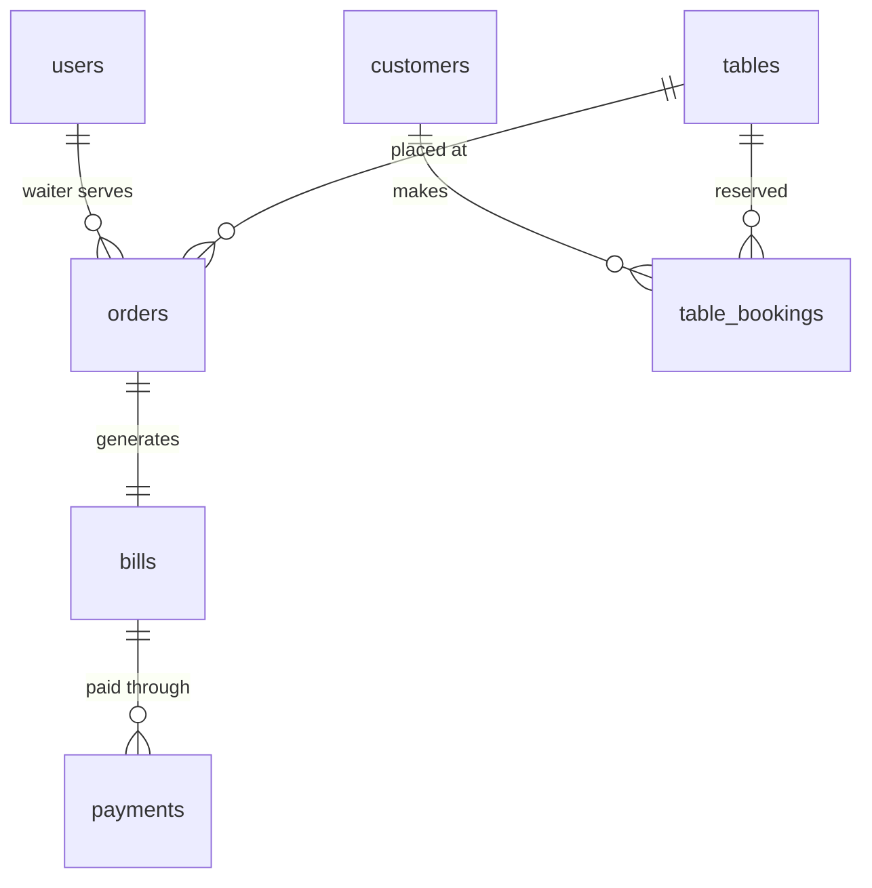

# Restaurant Management System

A comprehensive Java-based restaurant management system built with JDBC and PostgreSQL, featuring complete order management, billing, table booking, and customer management capabilities.

## 🚀 Features

### Core Functionality
- **User Management**: Role-based access for Managers, Waiters, and Kitchen Staff
- **Customer Management**: Customer registration and profile management
- **Table Management**: Table allocation, status tracking, and capacity management
- **Order Management**: Complete order lifecycle from placement to completion
- **Billing System**: Automated bill generation with tax and discount calculations
- **Payment Processing**: Multiple payment methods (Cash, Card, UPI, Wallet)
- **Table Booking**: Advance table reservations with date/time management
- **Sales Reporting**: Daily sales reports and analytics

### Technical Features
- **DAO Pattern**: Clean separation of data access logic
- **Service Layer**: Business logic abstraction
- **Factory Pattern**: Centralized DAO creation and management
- **PostgreSQL Integration**: Robust database connectivity
- **Console-based UI**: Interactive command-line interface

## 🏗️ Architecture

The project follows a layered architecture pattern:

```
src/main/java/org/example/
├── model/              # Entity classes (User, Customer, Order, etc.)
├── dao/               # Data Access Objects
│   ├── interfaces/    # DAO interfaces
│   └── impl/          # DAO implementations
├── service/           # Business logic layer
│   ├── interfaces/    # Service interfaces
│   └── impl/          # Service implementations
├── controller/        # UI controllers
├── util/              # Utility classes (DatabaseUtil)
└── Main.java          # Application entry point
```

## 📋 Prerequisites

- **Java 17** or higher
- **PostgreSQL 12** or higher
- **Maven 3.6** or higher

## 🛠️ Installation & Setup

### 1. Clone the Repository
```bash
git clone <repository-url>
cd restaurant-management-system
```

### 2. Database Setup

Create a PostgreSQL database and tables:

```sql
-- Create database
CREATE DATABASE restaurant_management;

-- Connect to the database and create tables
\c restaurant_management;

-- Users table
CREATE TABLE users (
    user_id SERIAL PRIMARY KEY,
    username VARCHAR(50) UNIQUE NOT NULL,
    password VARCHAR(100) NOT NULL,
    email VARCHAR(100) UNIQUE NOT NULL,
    phone VARCHAR(15),
    role VARCHAR(20) NOT NULL,
    is_active BOOLEAN DEFAULT true,
    created_at TIMESTAMP DEFAULT CURRENT_TIMESTAMP,
    updated_at TIMESTAMP DEFAULT CURRENT_TIMESTAMP
);

-- Customers table
CREATE TABLE customers (
    customer_id SERIAL PRIMARY KEY,
    name VARCHAR(100) NOT NULL,
    phone VARCHAR(15),
    email VARCHAR(100) UNIQUE,
    is_active BOOLEAN DEFAULT true,
    created_at TIMESTAMP DEFAULT CURRENT_TIMESTAMP,
    updated_at TIMESTAMP DEFAULT CURRENT_TIMESTAMP
);

-- Tables table
CREATE TABLE tables (
    table_id SERIAL PRIMARY KEY,
    table_number INTEGER UNIQUE NOT NULL,
    capacity INTEGER NOT NULL,
    status VARCHAR(20) DEFAULT 'Available',
    created_at TIMESTAMP DEFAULT CURRENT_TIMESTAMP,
    updated_at TIMESTAMP DEFAULT CURRENT_TIMESTAMP
);

-- Orders table
CREATE TABLE orders (
    order_id SERIAL PRIMARY KEY,
    table_id INTEGER REFERENCES tables(table_id),
    waiter_id INTEGER REFERENCES users(user_id),
    order_time TIMESTAMP DEFAULT CURRENT_TIMESTAMP,
    status VARCHAR(20) DEFAULT 'Placed',
    total_amount DECIMAL(10,2),
    created_at TIMESTAMP DEFAULT CURRENT_TIMESTAMP,
    updated_at TIMESTAMP DEFAULT CURRENT_TIMESTAMP
);

-- Bills table
CREATE TABLE bills (
    bill_id SERIAL PRIMARY KEY,
    order_id INTEGER REFERENCES orders(order_id),
    total_amount DECIMAL(10,2) NOT NULL,
    discount DECIMAL(10,2) DEFAULT 0,
    tax DECIMAL(10,2) DEFAULT 0,
    final_amount DECIMAL(10,2) NOT NULL,
    payment_status VARCHAR(20) DEFAULT 'Unpaid',
    generated_at TIMESTAMP DEFAULT CURRENT_TIMESTAMP,
    updated_at TIMESTAMP DEFAULT CURRENT_TIMESTAMP
);

-- Payments table
CREATE TABLE payments (
    payment_id SERIAL PRIMARY KEY,
    bill_id INTEGER REFERENCES bills(bill_id),
    amount_paid DECIMAL(10,2) NOT NULL,
    payment_method VARCHAR(20) NOT NULL,
    transaction_id VARCHAR(100),
    payment_time TIMESTAMP DEFAULT CURRENT_TIMESTAMP,
    status VARCHAR(20) DEFAULT 'Successful'
);

-- Table Bookings table
CREATE TABLE table_bookings (
    booking_id SERIAL PRIMARY KEY,
    customer_id INTEGER REFERENCES customers(customer_id),
    table_id INTEGER REFERENCES tables(table_id),
    booking_date DATE NOT NULL,
    booking_time TIME NOT NULL,
    party_size INTEGER,
    status VARCHAR(20) DEFAULT 'Confirmed',
    special_requests TEXT,
    created_at TIMESTAMP DEFAULT CURRENT_TIMESTAMP,
    updated_at TIMESTAMP DEFAULT CURRENT_TIMESTAMP
);
```

### 3. Configure Database Connection

Update database credentials in `src/main/java/org/example/util/DatabaseUtil.java`:

```java
private static final String URL = "jdbc:postgresql://localhost:5432/restaurant_management";
private static final String USER = "your_username";
private static final String PASSWORD = "your_password";
```

### 4. Build and Run

```bash
# Compile the project
mvn clean compile

# Run the application
mvn exec:java -Dexec.mainClass="org.example.Main"
```

## 🎯 Usage

### Main Menu Options

When you run the application, you'll see:

```
=== Restaurant Management System ===
1. User Management
2. Customer Management
3. Table Management
4. Order Management
5. Bill Management
6. Payment Management
7. Table Booking Management
8. Exit
```

### Sample Workflows

#### 1. Setting Up the System
```
1. Add Users (Manager, Waiters, Kitchen Staff)
2. Add Tables (Configure table numbers and capacity)
3. Add Customers (Register customer profiles)
```

#### 2. Order Management Workflow
```
1. Customer arrives → Check available tables
2. Seat customer → Waiter takes order
3. Order placed → Status: "Placed"
4. Kitchen prepares → Status: "Preparing"
5. Food served → Status: "Served"
6. Customer finishes → Status: "Completed"
```

#### 3. Billing Workflow
```
1. Generate bill for completed order
2. Apply discounts and calculate tax
3. Present bill to customer
4. Process payment (Cash/Card/UPI/Wallet)
5. Update payment status
6. Clear table for next customer
```

#### 4. Table Booking Workflow
```
1. Customer requests reservation
2. Check table availability for date/time
3. Create booking record
4. Confirm reservation
5. Update table status to "Reserved"
```

## 📊 Database Schema

### Key Entities

- **Users**: System users with roles (Manager, Waiter, KitchenStaff)
- **Customers**: Restaurant customers and their profiles
- **Tables**: Restaurant tables with capacity and status
- **Orders**: Customer orders with items and status tracking
- **Bills**: Generated bills with tax and discount calculations
- **Payments**: Payment records with multiple payment methods
- **Table Bookings**: Advance reservations with date/time

### Entity Relationships



## 🔧 Configuration

### Application Properties
- Database URL: `jdbc:postgresql://localhost:5432/restaurant_management`
- Driver: `org.postgresql.Driver`
- Connection pooling: Basic connection management

### User Roles and Permissions
- **Manager**: Full system access, user management, reports
- **Waiter**: Order management, customer service, billing
- **KitchenStaff**: Order status updates, kitchen operations

## 🎨 System Diagrams

The project includes comprehensive Mermaid diagrams:

### Class Diagram
Shows the complete system architecture with all classes, interfaces, and relationships.

### ER Diagram
Displays database schema with tables, fields, and relationships.

### Activity Diagrams
- Order Placement Workflow
- Billing Process Workflow
- Table Booking Workflow

## 📈 Future Enhancements

- [ ] **Web Interface**: Spring Boot-based web application
- [ ] **Menu Management**: Complete menu item management system
- [ ] **Inventory Tracking**: Stock management and supplier integration
- [ ] **Real-time Updates**: WebSocket-based real-time order tracking
- [ ] **Mobile App**: Android/iOS app for waiters and managers
- [ ] **Advanced Reporting**: Detailed analytics and business intelligence
- [ ] **Multi-location Support**: Support for restaurant chains
- [ ] **Integration APIs**: POS system and third-party integrations

## 🧪 Testing

```bash
# Run tests (when implemented)
mvn test

# Generate test coverage report
mvn jacoco:report
```

## 🤝 Contributing

1. Fork the repository
2. Create a feature branch (`git checkout -b feature/AmazingFeature`)
3. Commit your changes (`git commit -m 'Add some AmazingFeature'`)
4. Push to the branch (`git push origin feature/AmazingFeature`)
5. Open a Pull Request

### Coding Standards
- Follow Java naming conventions
- Use meaningful variable and method names
- Add comments for complex business logic
- Maintain consistent indentation

## 🐛 Known Issues

- Console input validation could be improved
- Error handling needs enhancement for database connection failures
- Transaction management not implemented for complex operations

## 📝 License

This project is licensed under the MIT License - see the [LICENSE](LICENSE) file for details.

## 👥 Authors

- **Your Name** - *Initial work* - [YourGitHub](https://github.com/yourusername)

## 🙏 Acknowledgments

- PostgreSQL team for the robust database system
- Maven for dependency management
- Java community for excellent documentation
- Mermaid.js for beautiful diagrams

## 📞 Support

For support and questions:
- Create an issue in this repository
- Email: your-email@example.com

---

**Built with ❤️ for efficient restaurant management**
