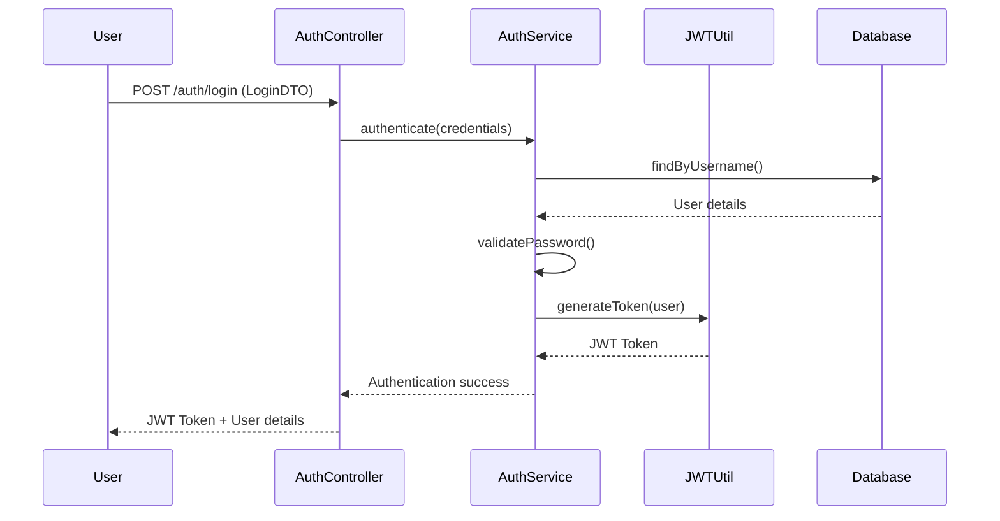
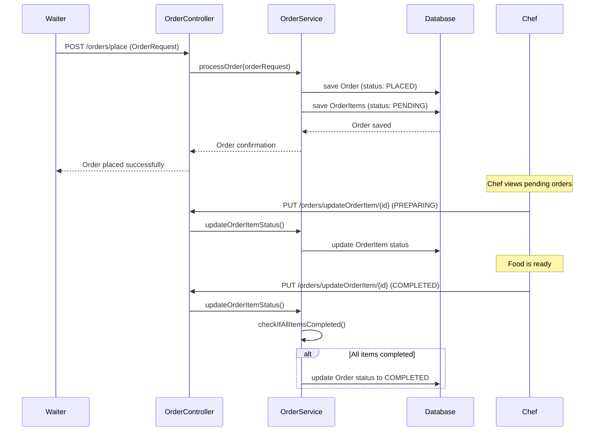
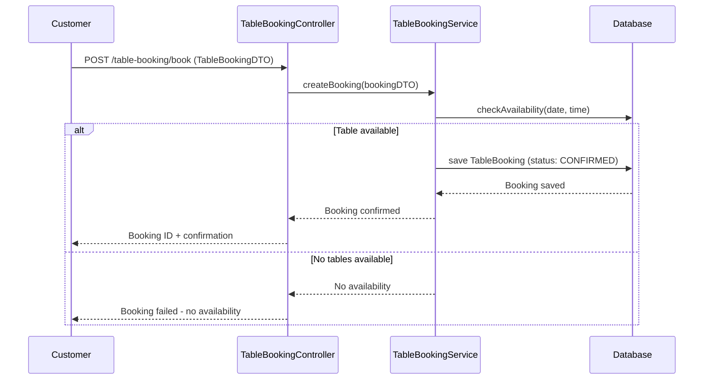
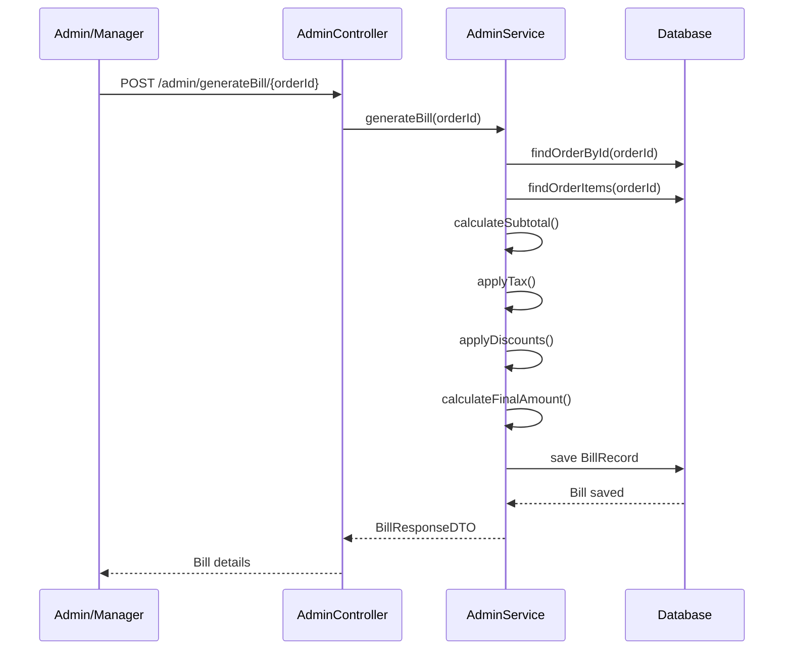
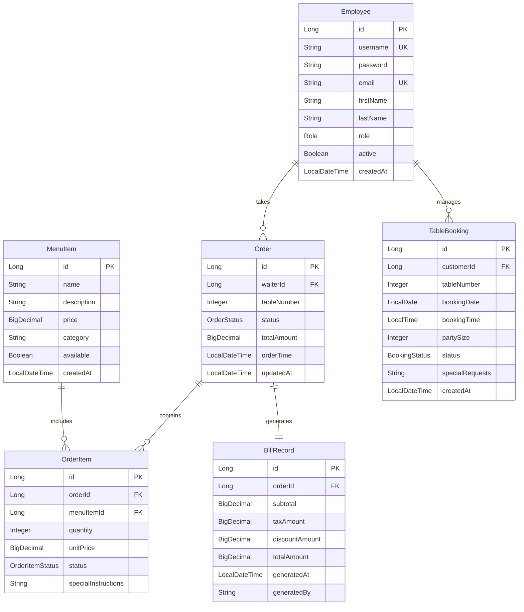

# 🍽️ Restaurant Management System - Spring Boot Edition

A comprehensive **Spring Boot** application for managing restaurant operations with **JWT-based authentication**, **role-based access control**, and complete **order-to-billing workflow**.

## 🚀 Technology Stack

- **Java 17+**
- **Spring Boot 3.x**
- **Spring Security** with **JWT Authentication**
- **Spring Data JPA** with **Hibernate**
- **PostgreSQL** Database
- **Maven** Build Tool
- **RESTful API** Architecture

---

## ✨ Core Features

### 🔐 Authentication & Authorization
- **JWT-based Authentication** for secure API access
- **Role-based Access Control** with 5 distinct roles
- **Token-based Session Management**

### 👥 User Management
- **Multi-role System**: `ADMIN`, `MANAGER`, `WAITER`, `CHEF`, `CUSTOMER`
- **Employee Registration** by Admin
- **Customer Self-registration** for table bookings

### 🍕 Menu Management
- **CRUD Operations** for menu items
- **Category-based Organization**
- **Real-time Availability** tracking

### 📋 Order Processing
- **Multi-step Order Workflow**
- **Real-time Status Updates**
- **Item-level Status Tracking**
- **Kitchen-Waiter Coordination**

### 🪑 Table Booking System
- **Advanced Reservation Management**
- **Date-time Based Availability**
- **Booking Status Tracking**
- **Customer Notification System**

### 💳 Billing & Payments
- **Automated Bill Generation**
- **Tax and Discount Calculations**
- **Payment Status Tracking**
- **Financial Reporting**

---

## 🏗️ Project Architecture

### Package Structure
```
src/main/java/com/zeta_training/restaurant_management_system/
├── 📁 config/                 # Security & Application Configuration
│   ├── JwtAuthenticationFilter.java
│   └── SecurityConfig.java
├── 📁 controller/             # REST API Controllers
│   ├── AdminController.java
│   ├── AuthorizationController.java
│   ├── CustomerOrderController.java
│   ├── MenuController.java
│   └── TableBookingController.java
├── 📁 dto/                    # Data Transfer Objects
│   ├── BillResponseDTO.java
│   ├── LoginDTO.java
│   ├── MenuItemDTO.java
│   ├── OrderItemRequest.java
│   ├── OrderItemResponseDTO.java
│   ├── OrderRequest.java
│   ├── RegisterDTO.java
│   ├── StatusDTO.java
│   └── TableBookingDTO.java
├── 📁 entity/                 # JPA Entities
│   ├── BillRecord.java
│   ├── Employee.java
│   ├── MenuItem.java
│   ├── Order.java
│   ├── OrderItem.java
│   └── TableBooking.java
├── 📁 enumeration/            # Enum Classes
│   ├── BookingStatus.java
│   ├── OrderItemStatus.java
│   ├── OrderStatus.java
│   └── Role.java
├── 📁 exception/              # Exception Handling
│   ├── GlobalExceptionHandler.java
│   ├── InvalidTokenException.java
│   └── ResourceNotFoundException.java
├── 📁 repository/             # Data Access Layer
│   ├── BillRecordRepository.java
│   ├── EmployeeRepository.java
│   ├── MenuItemRepository.java
│   ├── OrderItemRepository.java
│   ├── OrderRepository.java
│   └── TableBookingRepository.java
├── 📁 service/                # Business Logic Layer
│   ├── AuthorizationService.java
│   ├── CustomerOrderService.java
│   ├── MenuService.java
│   └── TableBookingService.java
└── 📁 util/                   # Utility Classes
    └── RestaurantManagementSystemApplication.java
```

---

## 🔄 Application Flow

### 1. Authentication Flow


### 2. Order Processing Flow


### 3. Table Booking Flow


### 4. Bill Generation Flow


---

## 🎭 Role-Based Access Control

### Role Hierarchy & Permissions

| Role | Permissions | Access Level |
|------|-------------|-------------|
| **ADMIN** 👑 | • Register all employees<br>• Generate bills<br>• System administration<br>• View all data | **Full System Access** |
| **MANAGER** 🏢 | • Manage menu items<br>• View bookings<br>• Oversee operations<br>• Staff coordination | **Management Level** |
| **WAITER** 👨‍💼 | • Take orders<br>• Update order status<br>• Customer service<br>• Table management | **Service Level** |
| **CHEF** 👨‍🍳 | • Update order item status<br>• Kitchen operations<br>• Food preparation tracking | **Kitchen Level** |
| **CUSTOMER** 🧑‍💼 | • Book tables<br>• View menu<br>• Make reservations | **Guest Level** |

---

## 📊 Data Model & Relationships



---

## 🛡️ Security Implementation

### JWT Authentication
- **Token Generation** on successful login
- **Request Filtering** via `JwtAuthenticationFilter`
- **Role-based Authorization** on endpoints
- **Token Expiration** handling

### Password Security
- **Encrypted Password** storage
- **Secure Authentication** flow
- **Session Management** via JWT tokens

### API Security
- **CORS Configuration** for cross-origin requests
- **CSRF Protection** disabled for stateless APIs
- **Role-based Endpoint Protection**

---

## 📱 API Endpoints

### 🔐 Authentication APIs (`/auth`)
| Method | Endpoint | Role | Description |
|--------|----------|------|-------------|
| `POST` | `/auth/registerAdmin` | Public | Register system admin |
| `POST` | `/auth/login` | Public | User login & JWT generation |

### 👨‍💼 Admin APIs (`/admin`)
| Method | Endpoint | Role | Description |
|--------|----------|------|-------------|
| `POST` | `/admin/registerRestaurantEmployee` | ADMIN | Register restaurant staff |
| `POST` | `/admin/generateBill/{orderId}` | ADMIN | Generate order bill |

### 🍕 Menu APIs (`/menuItem`)
| Method | Endpoint | Role | Description |
|--------|----------|------|-------------|
| `POST` | `/menuItem/addMenuItem` | MANAGER | Add new menu item |
| `GET` | `/menuItem/getAllMenuItems` | ALL | Get all menu items |
| `DELETE` | `/menuItem/deleteMenuItem/{id}` | MANAGER | Delete menu item |

### 📋 Order APIs (`/orders`)
| Method | Endpoint | Role | Description |
|--------|----------|------|-------------|
| `POST` | `/orders/place` | WAITER | Place new order |
| `PUT` | `/orders/updateOrderItem/{orderItemId}` | CHEF | Update order item status |

### 🪑 Table Booking APIs (`/table-booking`)
| Method | Endpoint | Role | Description |
|--------|----------|------|-------------|
| `POST` | `/table-booking/book` | CUSTOMER | Create table booking |
| `GET` | `/table-booking/getAll` | MANAGER | Get all bookings |
| `GET` | `/table-booking/get/{id}` | ALL | Get booking by ID |
| `PUT` | `/table-booking/update/{id}` | CUSTOMER/MANAGER | Update booking |
| `DELETE` | `/table-booking/delete/{id}` | CUSTOMER/MANAGER | Cancel booking |
| `PUT` | `/table-booking/updateStatus/{id}` | MANAGER | Update booking status |

---

## 🚀 Getting Started

### Prerequisites
- **Java 17** or higher
- **PostgreSQL 12** or higher
- **Maven 3.6** or higher
- **IDE** (IntelliJ IDEA/Eclipse recommended)

### Installation Steps

1. **Clone the Repository**
```bash
git clone <your-repository-url>
cd restaurant-management-system
```

2. **Database Setup**
```sql
CREATE DATABASE restaurant_management_db;
-- Tables will be auto-created by Hibernate
```

3. **Configure Application Properties**
   Update `src/main/resources/application.properties`:
```properties
# Database Configuration
spring.datasource.url=jdbc:postgresql://localhost:5432/your_database
spring.datasource.username=your_username
spring.datasource.password=your_password


```

## 🔧 Configuration Details

### JWT Configuration
- **Secret Key**: Configurable via `application.properties`
- **Token Expiration**: 24 hours (configurable)
- **Header**: `Authorization: Bearer <token>`

### Database Configuration
- **Auto-DDL**: Tables created automatically
- **Connection Pooling**: Default HikariCP
- **Hibernate Dialect**: PostgreSQL optimized

### Security Configuration
- **CORS**: Enabled for frontend integration
- **CSRF**: Disabled for REST APIs
- **Session Management**: Stateless (JWT-based)
